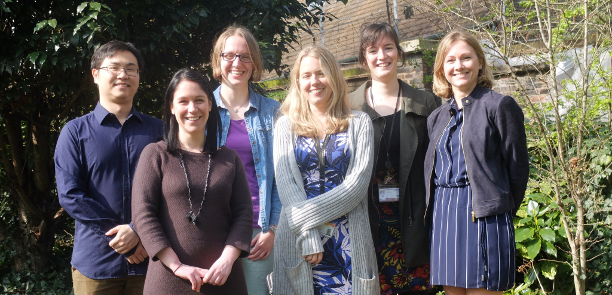

We are the Language Learning Lab at the Department of Education at University of Oxford. Our research investigates how children and adults learn languages. Our lab is directed by Dr Elizabeth Wonnacott. This is an open repo that contains functions that we use in our research. 

Full web page of the lab: https://languagelearninglab-ox.com/